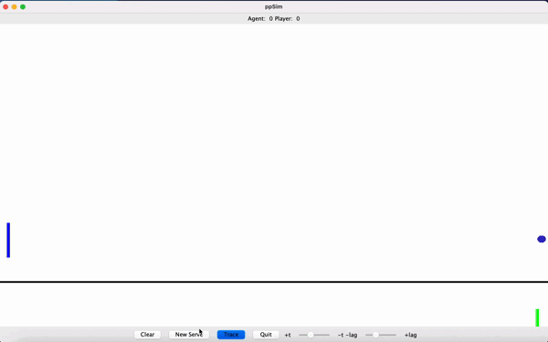

<!---big title--->
# Ping-Pong Game on Java
<!---smaller title: make different sections--->
## About the project
### Description:
Welcome!
This is a ping-pong game implemented using Java and ACM graphics program, in the scope of an Introduction to Software Development class at McGill University.

A GIF of the gameplay is shown below:

    

In this ping-pong game with a computer (Agent), the user moves their paddle with the cursor and can control the game's difficulty by adjusting the time lag and the agent's response time lag. The trajectory of the ball can be shown, and the user can reset the game by clearing the scores. 

### Buttons:
* Clear: sets all scores to 0
* New Serve: Agent serves the ball
* Trace: toggle (switch) button that traces the ball's trajectory
* Quit: closes the game
* Time-lag slider: sets the time lag (slide to the right for more lag, and vice-versa)
* Agent-lag slider: sets the Agent's response lag (slide to the right for more lag, and vice-versa)

### Built using:
* Java programming language
* ACM graphics program
* Eclipse IDE (Java SE 1.8)

## Installation
### Required Downloads:
* Eclipse IDE: install [**here**](https://www.eclipse.org/downloads/ "Eclipse Install")
* JDK: install using [**Oracle**](https://www.oracle.com/java/technologies/downloads/ "Install JDK") (this project used version 1.8)
* acm.jar package - copy & paste the following on browser to download automatically: cs.stanford.edu/people/eroberts/jtf/acm.jar
* All .java files inside src/ppPackage (in The first commit)

### Setting the Game:
1. Create a new Java project in Eclipse using downloaded JDK
2. Write click on the project, then Build Path>Configure Build Path.
3. Press Add External JARs, select acm.jar and open, then Apply and Close. 
4. Inside the project, create a class for each .java file and set each class's name to the name of the corresponding .java file
5. Copy and paste the content of each .java file into the respective class inside your project
6. Run the ppSim class

## References/Courtesy
<!---italics and bold--->
* As this project was developed in the scope of an Introduction to Software Development course at McGill University, part of the code used was taken from professor Frank Ferrie (instructor for ECSE-202, Fall 2021) and Katerina Poulin (TA for ECSE-202, Fall 2021).  
* Some additional resources:
  * https://stackoverflow.com/a/17456465
  * https://www.educative.io/edpresso/how-to-convert-an-integer-to-a-string-in-java?fbclid=IwAR3Bk7JrRtkxF2_ub5qgkCFbIP2Sekb7kD8_haKCV4B9Blc2J0ld6Maq1lg

Parsa Langari
